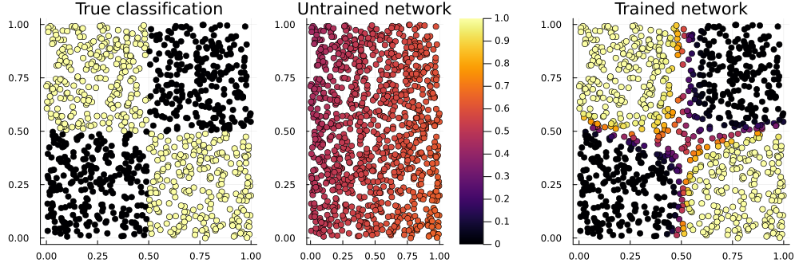

## 〇、前言
`Flux.jl` 是 Julia 语言的一个机器学习库。这里是对 Flux 官方文档的学习笔记。

### 0.1. 一些资料
- [Julia 中文文档](https://docs.juliacn.com/latest/)
- [《Julia Data Science》中文版](https://cn.julialang.org/JuliaDataScience/)
- [Julia语言入门](https://www.math.pku.edu.cn/teachers/lidf/docs/Julia/html/_book/index.html)
- [Flux](https://fluxml.ai/)

## 1. 开始

### 1.1. 从线性拟合开始


```julia
# 加载Flux
using Flux
```


```julia
# 定义一条线性函数
actual(x) = 4x + 2

## actual (generic function with 1 method)
```

#### 生成训练数据


```julia
x_train, x_test = hcat(0:5...), hcat(6:10...)

## ([0 1 … 4 5], [6 7 … 9 10])
```

> 关于 "splat" 符号，即 "..." 的含义说明（参见 [Julia 文档](https://docs.julialang.org/en/v1/base/base/)）：
>
> Julia 中的 "splat" 表示一系列参数。通常在函数定义中使用，表示此函数可接受任意数量的参数。"splat" 也可以用于将函数应用于一个参数序列，请看下例：
>```
> julia> add(xs...) = reduce(+, xs)
> add (generic function with 1 method)
>
> julia> add(1, 2, 3, 4, 5)
> 15
>
> julia> add([1, 2, 3]...)
> 6
>
> julia> add(7, 1:100...)
> 5057
>```


```julia
y_train, y_test = actual.(x_train), actual.(x_test)

## ([2 6 … 18 22], [26 30 … 38 42])
```

#### 构建模型

现在，构建具有1个输入和一个1个输出的预测模型：


```julia
model = Dense(1 => 1)

## Dense(1 => 1)       # 2 parameters
```

```julia
model.weight

## 1×1 Matrix{Float32}:
##  1.2312237
```

```julia
model.bias

## 1-element Vector{Float32}:
##  0.0
```

```julia
Flux.params(model)

## Params([Float32[1.2312237;;], Float32[0.0]])
```

`Dense` “层”是一个具有 `weights` 和 `bias` 的结构。`weights`代表权重矩阵，`bias`代表偏差向量。在 Flux 中，模型也可以看作是预测函数：


```julia
predict = Dense(1 => 1)

## Dense(1 => 1)       # 2 parameters
```

`Dense(1 => 1)` 还实现了函数 `σ(Wx+b)`，其中 `W` 和 `b` 是权重和偏差。`σ` 是一个激活函数（sigmoid）。我们的模型有一个权重和一个偏差，但实际建模中会有更多参数。

> 注意：`σ` 可以通过 `\sigma` + Tab键敲出来！Julia的变量命名时非常灵活的，参见[Julia中文文档——变量](https://docs.juliacn.com/latest/manual/variables/) 。

将权重和偏差视为可以用来调整预测的旋钮和杠杆。激活函数是模型中的非线性变换，可以根据需求选择不同的激活函数。现在我们的模型就可以做预测，不过精度非常差：


```julia
predict(x_train)

## 1×6 Matrix{Float32}:
##  0.0  0.618757  1.23751  1.85627  2.47503  3.09378
```

为了做出更好的预测，需要提供一个损失函数来告诉 Flux 如何客观地评估预测的精度。如下为均方损失 MSE：


```julia
loss(x, y) = Flux.Losses.mse(predict(x), y)
loss(x_train, y_train)

## 142.61317f0
```

### 1.2. 提高预测精度

有了损失函数和训练数据后，通过 `Flux.train!` 函数可利用优化器改进模型的参数：


```julia
using Flux: train!
data = [(x_train, y_train)]
opt = Descent(0.1)

## Descent(0.1)
```

这里的 `Descent()` 指的是梯度下降法，括号里的参数是学习率。

每个模型都是带有函数和可配置参数 的Julia 结构：


```julia
predict.weight

## 1×1 Matrix{Float32}:
##  0.61875653
```


```julia
predict.bias

## 1-element Vector{Float32}:
##  0.0
```

```julia
parameters = Flux.params(predict)
predict.weight in parameters, predict.bias in parameters
```

一切就绪，我们使用 `Flux.train!` 来训练模型：

```julia
train!(loss, parameters, data, opt)

## (true, true)
```


```julia
loss(x_train, y_train)

## 135.34093f0
```

可以看出损失函数减小了！参数也发生了变化：


```julia
parameters

## Params([Float32[7.8177032;;], Float32[2.0906217]])
```

### 1.2+. 迭代预测


```julia
for epoch in 1:200
    train!(loss, parameters, data, opt)
end

loss(x_train, y_train)

## 0.0039517772f0
```

```julia
parameters
## Params([Float32[4.0192595;;], Float32[2.0054226]])
```

### 1.3. 验证结果


```julia
predict(x_test)

## 1×5 Matrix{Float32}:
##  26.121  30.1402  34.1595  38.1788  42.198
```


```julia
y_test

##  1×5 Matrix{Int64}:
##   26  30  34  38  42
```

可以看出模型已经有了不错的精度。

## 2. 梯度和层

### 2.1. 计算梯度

`gradient`函数接受另一个 Julia 函数和一组参数，并返回关于每个参数的梯度。

```julia
using Flux
f(x) = 3x^2 + 2x + 1;
df(x) = gradient(f, x)[1]; # df/dx = 6x + 2
df(2)

## 14.0
```

请注意，`gradient()` 函数的返回值是元组（Tuple），所以要用 `gradient(f, x)[1]` 取出导数值。


```julia
d2f(x) = gradient(df, x) # d²f/dx² = 6
d2f(2)

## (6.0,)
```

当函数具有多个参数时，我们可以同时计算关于每个参数的梯度：


```julia
f(x, y) = sum((x .- y).^2);
gradient(f, [2, 1], [2, 0])

## ([0.0, 2.0], [-0.0, -2.0])
```

这里的 `.-` 和 `.^2` 是对元素逐点运算。注意到 `f(x, y)` 的梯度为 $(2x-2y, 2y-2x)$ ,其中 $x$ 代表第一个位置，$y$ 代表第一个位置。事实上`gradient(f, [2, 1], [2, 0])`的第一个返回值是第一个位置的梯度 $$\left(\frac{\partial f(2, 2)}{\partial x}, \frac{\partial f(1, 0)}{\partial x}\right) = (0, 2),$$ 第二个返回值是第二个位置的梯度 $$\left(\frac{\partial f(2, 2)}{\partial y}, \frac{\partial f(1, 0)}{\partial y}\right) = (0, -2).$$
要注意到这里计算出两个向量分别是 $x,y$ 两个位置的导数，而不是数学上的梯度记号： $\nabla f(x,y) = \left(\partial f(x, y)/\partial x, \partial f(x, y)\partial y\right)$

机器学习中经常要处理起码*上百个*参数，在 Flux 中通过 `params` 函数来有效地处理梯度计算, 当处理大型和复杂模型时，这将非常方便。还以上面的梯度计算为例：


```julia
x = [2, 1, 9];
y = [2, 0, 3];
gs = gradient(Flux.params(x, y)) do
    f(x, y)
end

## Grads(...)
```

```julia
gs[x]

## 3-element Vector{Float64}:
##   0.0
##   2.0
##  12.0
```

```julia
gs[y]

## 3-element Vector{Float64}:
##   -0.0
##   -2.0
##  -12.0
```

这里通过 `params` 函数告诉 `gradient` 应当对哪些参数求导。

### 2.2. 构建简单模型

考虑一个通过 5 维的输入 `x` 预测 2 维的 `y` 的简单线性回归模型


```julia
W = rand(2, 5)
b = rand(2)

pred(x) = W*x .+ b

function loss(x, y)
      hat_y = pred(x)
  sum((y .- hat_y).^2)
end

x, y = rand(5), rand(2) # Dummy data
loss(x, y)

## 3.418556151350241
```

接下来定义损失函数关于 `W` 和 `b` 的梯度：


```julia
using Flux

gs = gradient(() -> loss(x, y), Flux.params(W, b))

## Grads(...)
```


利用梯度更新参数 `W` (梯度下降法)：


```julia
W_grad = gs[W]

W .-= 0.1 .* W_grad

loss(x, y)

## 1.183225820733132
```

可以看到梯度的减小！在真实建模时，我们可以通过这种方式计算模型的参数，这是深度学习中最重要的一环。在 Flux 深度学习中，无论多么复杂的模型，其本质和这个小例子都是相似的。同样的，我们可以利用梯度下降法更新参数 `b` 的值。


```julia
b_grad = gs[b]

b .-= 0.1 .* b_grad

loss(x, y)

## 0.5154882191435916
```

### 2.3. 构建层
接下来我们使用 sigmaod 函数 `σ` 构建一个两层的神经网络：


```julia
using Flux

W1 = rand(3, 5)
b1 = rand(3)
layer1(x) = W1 * x .+ b1

W2 = rand(2, 3)
b2 = rand(2)
layer2(x) = W2 * x .+ b2

model1(x) = layer2(σ.(layer1(x)))

model1(rand(5)) # => 2-element vector

## 2-element Vector{Float64}:
##  1.7697848336321962
##  0.8960129325524029
```

当然，这看起来相当笨拙，特别是构建一个特别复杂的神经网络时。我们可以创建一个返回一个线性层的函数。


```julia
function linear(in, out)
  W = randn(out, in)
  b = randn(out)
  x -> W * x .+ b
end

linear1 = linear(5, 3) # we can access linear1.W etc
linear2 = linear(3, 2)

model2(x) = linear2(σ.(linear1(x)))

model2(rand(5)) # => 2-element vector

## 2-element Vector{Float64}:
##  2.0574773918821374
##  0.8128343563885203
```


另一种方法是创建一个自定义结构来表示层：


```julia
struct Affine
  W
  b
end

Affine(in::Integer, out::Integer) =
  Affine(randn(out, in), randn(out))

# Overload call, so the object can be used as a function
(m::Affine)(x) = m.W * x .+ m.b

a = Affine(10, 5)

a(rand(10)) # => 5-element vector

## 5-element Vector{Float64}:
##  -0.29885511087350647
##   3.3635492772221056
##   0.38360860396148594
##   0.6869481774995468
##   3.2762994378381336
```

这就是 Flux 中的 `Dense` 层的基本思想！Flux 有许多有趣的层，但其实它们都是可以很容易地创建的。后面我们就直接用 `Dense()` 啦！

### 2.4. 堆叠多个层

最简单的方式是：
```julia
layer1 = Dense(10 => 5, σ)
# ...
model3(x) = layer3(layer2(layer1(x)))

## 2-element Vector{Float64}:
##  0.6971572615200797
##  0.30284273847992016
```
对于复杂结构，利用 `foldl` 函数，如下方式更加直观：


```julia
using Flux

layers = [Dense(10 => 5, σ), Dense(5 => 2), softmax]

model3(x) = foldl((x, m) -> m(x), layers, init = x)

model3(rand(10)) # => 2-element vector

## 2-element Vector{Float64}:
##  0.4669894458736007
##  0.5330105541263993
```


Flux 中也提供了如下方式：


```julia
model4 = Chain(
  Dense(10 => 5, σ),
  Dense(5 => 2),
  softmax)

model4(rand(10)) # => 2-element vector

## 2-element Vector{Float64}:
##  0.4669894458736007
##  0.5330105541263993
```

模型本质上也是函数，因此也可以写成符合函数的形式：


```julia
m = Dense(5 => 2) ∘ Dense(10 => 5, σ)

m(rand(10))

## 2-element Vector{Float64}:
##  0.12803814672265756
##  0.6608028813019428
```

可以向使用函数一样使用 `Chain`：


```julia
m = Chain(x -> x^2, x -> x+1)

m(5) # => 26

## 26
```


### 2.5. 关于层的一些说明

前面所定义的 `Affine` 嗐存在一些问题，比如 Flux 无法查看其内部，这意味着 `Flux.train!` 无法获取模型的参数，也无法使用 gpu 进行训练。可以通过 `@functor` 指令开启这些功能：


```julia
Flux.@functor Affine
```

在 Flux 的层中可以加入偏差（bias），并允许您提供用于生成随机权重的函数。下例将这些细节添加到我们的模型中：


```julia
function Affine((in, out)::Pair; bias=true, init=Flux.randn32)
  W = init(out, in)
  b = Flux.create_bias(W, bias, out)
  Affine(W, b)
end

Affine(3 => 1, bias=false, init=ones) |> gpu

## Affine(Float32[1.0 1.0 1.0], false)
```

**关于 `Flux.create_bias` 函数**
```
create_bias(weights, bias, size...)
```
在隐藏层中返回偏差参数。
- `bias == true`: 创建给定大小的可训练数组，其类型与 `weights` 相同, 初始化为零。
- `bias == false`：返回`false`，这在梯度计算中被理解为不可微的。
- `bias::AbstractArray`：使用提供的 array，当然它的维数需要和模型一致。目前，它无法纠正 `eltype` 以匹配权重。

## 3. 示例——XOR（异或运算）

关于异或函数与深度学习，可以参考 [Goodfellow et al (2016)](https://www.deeplearningbook.org/) 一书，或者 [Zhan (2022)]([https://onlinelibrary.wiley.com/doi/10.1002/sim.9564)。


```julia
# 加载需要的包
using Flux, Statistics

# 生成 XOR 问题的数据：
noisy = rand(Float32, 2, 1000)                                    # 2×1000 Matrix{Float32}
truth = map(col -> xor(col...), eachcol(noisy .> 0.5));            # 1000-element Vector{Bool}
```


```julia
# 定义一个具有三个节点的隐藏层的模型：
model = Chain(
    Dense(2 => 3, tanh), BatchNorm(3), 
    Dense(3 => 2), 
    softmax
)

# 模型封装了随机初始化的参数。其初始输出为：
out1 = model(noisy)                                               # 
## 2×1000 Matrix{Float32}:
##  0.589813  0.628855  0.593403  0.601408  …  0.602531  0.581119  0.612576
##  0.410187  0.371145  0.406597  0.398592     0.397469  0.418881  0.387424
```

> 关于 `BatchNorm(3)`, 参见 [Loeef et al (2015)](https://arxiv.org/abs/1502.03167)。初学时可以先忽略这里（其实我也没看）。


```julia
# 批量大小设置为64:
mat = Flux.onehotbatch(truth, [true, false])                      # 2×1000 OneHotMatrix
data = Flux.DataLoader((noisy, mat), batchsize=64, shuffle=true);
first(data) .|> summary                                           # ("2×64 Matrix{Float32}", "2×64 Matrix{Bool}")

## ("2×64 Matrix{Float32}", "2×64 OneHotMatrix(::Vector{UInt32}) with eltype Bool")
```


```julia
pars = Flux.params(model)  # 模型参数
opt = Flux.Adam(0.01)      # 选择优化器

## Adam(0.01, (0.9, 0.999), 1.0e-8, IdDict{Any, Any}())
```


```julia
loss(x, y) = Flux.crossentropy(model(x), y) #损失函数选为交叉熵

## loss (generic function with 1 method)
```


```julia
# 训练1000个周期
for epoch in 1:1000
    Flux.train!(loss, pars, data, opt)
end

pars

## Params([Float32[4.077289 3.338552; 0.0116047375 -0.591737; -2.9438004 3.6515594], Float32[-2.5128667, 2.68663, -1.5515282], Float32[-0.10405523, -0.029542167, -0.049344636], Float32[2.5655665, 3.684893, 2.9285743], Float32[1.6369188 2.1312404 2.1296957; -2.270672 -2.6577244 -2.4688752], Float32[-0.040889386, 0.0408973]])
```


```julia
out2 = model(noisy)

## 2×1000 Matrix{Float32}:
##  0.999999    1.09363f-7  0.996885    …  0.299783  0.653893  0.999999
##  9.55848f-7  1.0         0.00311446     0.700217  0.346107  7.02566f-7
```


```julia
mean((out2[1,:] .> 0.5) .== truth)

## 0.934
```

可以看出，精度已经很高了

```julia
using Plots

p_true = scatter(noisy[1,:], noisy[2,:], zcolor=truth, title="True classification", legend=false)
p_raw =  scatter(noisy[1,:], noisy[2,:], zcolor=out1[1,:], title="Untrained network", label="", clims=(0,1))
p_done = scatter(noisy[1,:], noisy[2,:], zcolor=out2[1,:], title="Trained network", legend=false)

plot(p_true, p_raw, p_done, layout=(1,3), size=(1000,330))
```



